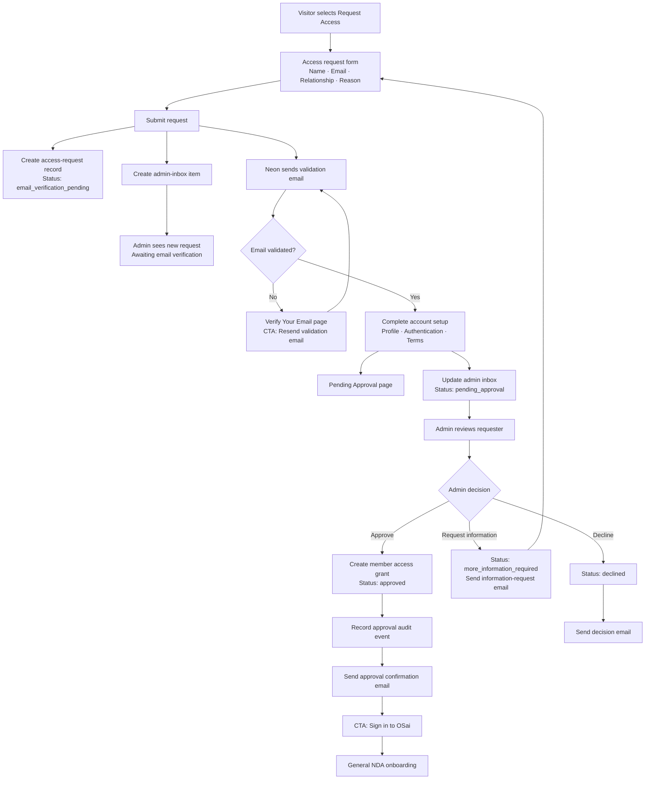

# Access Request and Approval Flow

## Purpose

This document defines the invite/access-request experience using Neon for identity and email validation while Orbit Systems retains explicit control over membership approval.

## Governing rules

1. Submitting an access request creates an OSai access-request record and an item in the admin inbox.
2. Neon sends a validation email to the requester at the same time.
3. A validated Neon identity does not grant OSai membership.
4. After email validation and account completion, the requester sees **Pending Approval**.
5. An authorized administrator must approve the request before member access is granted.
6. Approval creates a durable access grant and audit event before the confirmation email is sent.
7. General NDA onboarding occurs after approval unless the approved legal/product policy changes this sequence.

## End-to-end flow

## Page requirements

### Request Access

Required fields:

- Name
- Email
- Relationship or connection to Orbit Systems
- Reason for requesting access
- Required consent and policy acknowledgements

Primary CTA: **Submit request**

On submission, show a neutral confirmation that instructs the requester to validate their email. Do not imply that access has been granted.

### Verify Your Email

Required content:

- The validated destination email, partially masked where appropriate
- Explanation that validation is required before account setup can continue
- Primary CTA: **Open email** when supported
- Secondary CTA: **Resend validation email**
- Utility action: **Use a different email**

### Pending Approval

Heading: **Your access request is pending approval**

Body copy:

> Your email is verified and your account setup is complete. An Orbit Systems administrator is reviewing your request. We’ll send a confirmation to your verified email address when a decision is made.

Actions:

- Primary CTA: **View request status**
- Secondary CTA: **Return to home**
- Utility actions: **Update profile** and **Sign out**

The page must not expose member navigation or protected project content.

### Approval confirmation email

The email should confirm that the request has been approved, identify Orbit Systems/OSai clearly, and provide a safe, expiring or standard authenticated route into the next onboarding step.

Primary CTA: **Sign in to OSai**

After sign-in, route the user to the General NDA explanation rather than directly to protected content.

## Admin inbox requirements

Each access-request row must show:

- Requester name and verified email
- Email-validation state
- Account-completion state
- Request date and time in current state
- Relationship and stated reason for access
- Assigned administrator
- Last reminder and next recommended action
- Actions: **Approve**, **Request information**, **Decline**, and **Open timeline**

## Authorization and data requirements

- Link application profiles to the immutable Neon Auth user ID; do not use email as the relational key.
- Validate the Neon session server-side on every protected request.
- Store OSai approval and access grants in application-owned records, separate from authentication state.
- Make decision endpoints role-restricted and idempotent.
- Record submission, validation, account completion, decisions, grant creation, and email delivery as distinct events.
- Do not send an approval email until the access grant and audit event have committed successfully.
