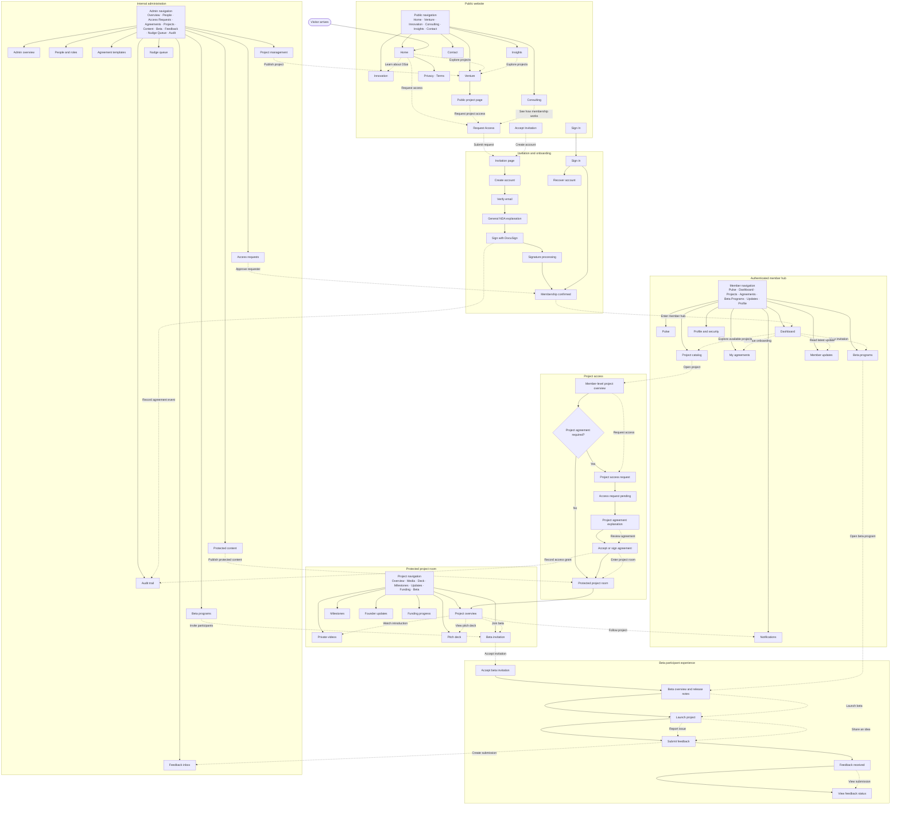

# OSai Website Information Architecture

## Purpose

This document defines the pages, navigation menus, and principal calls to action across the OSai public website, authenticated member hub, protected project rooms, beta experience, and internal administration area.

## Global flow

Solid edges represent navigation or system progression. Dashed edges represent a primary CTA.

## Navigation menus

### Public navigation

- Home
- Venture
- Innovation
- Consulting
- Insights
- Contact
- Client Portal (lock icon; opens the sign-in route)
- Primary CTA: **Start a conversation**

The public logo and navigation remain fixed while a page scrolls. Desktop uses the full navigation; mobile uses a hamburger-triggered full-screen menu. Public pages do not use a footer.

### Member navigation

- Pulse
- Dashboard
- Projects
- Agreements
- Beta Programs
- Updates
- Notifications
- Profile and Security

### Project-room navigation

- Overview
- Media
- Deck
- Milestones
- Updates
- Funding
- Beta

### Admin navigation

- Overview
- People
- Access Requests
- Agreements
- Projects
- Content
- Beta
- Feedback
- Nudge Queue
- Audit

## Critical conversion paths

1. `Home → Request Access → Verify Email → Complete Account → Pending Approval → Approved → General NDA → Member Dashboard`
2. `Project Catalog → Project Overview → Project Access Request → Project Agreement → Protected Project Room`
3. `Project Room → Beta Invitation → Launch Product → Submit Feedback`

## Access boundary rule

Menus and CTAs may explain unavailable areas, but protected pages and resources must enforce authorization server-side. Hiding a link is not an access-control mechanism.
