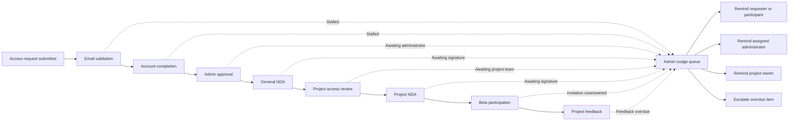

# Lifecycle Tracking and Nudges

## Purpose

Administrators need a single operational view of every person’s progress across access requests, identity validation, account completion, approval, agreements, project access, beta participation, and feedback. The system must identify stalled work and help the correct party move it forward.

## Lifecycle flow

## Person lifecycle timeline

Each person record should show a chronological timeline of:

- Access request submitted
- Validation email sent and delivery result
- Email verified
- Account completed
- Approval pending, approved, declined, or more information requested
- General NDA sent, viewed, signed, expired, or superseded
- Project access requested and assigned
- Project-owner feedback pending or received
- Project NDA sent and signed
- Beta invitation sent and accepted
- Product participation recorded where consent and policy allow it
- Feedback requested and received
- Every reminder, assignment, status change, escalation, and administrator action

## Nudge Queue

The admin navigation must include **Nudge Queue**. It should support these operational views:

- Awaiting email validation
- Account incomplete
- Awaiting admin approval
- General NDA unsigned
- Project review overdue
- Project NDA unsigned
- Beta invitation unanswered
- Project feedback overdue
- Recently nudged
- Escalation required

Each queue item should display:

- Person or responsible party
- Project, beta program, or agreement where applicable
- Current state
- Time in current state
- Assigned owner
- Last activity
- Last nudge and delivery result
- Recommended next action

Example status line:

> Stalled at General NDA for 4 days · Last reminder sent July 26 · Next action: Send reminder or contact directly.

## Nudge actions

- **Send reminder**
- **Preview message**
- **Copy secure link**
- **Change owner**
- **Snooze**
- **Mark resolved**
- **Escalate**

## Recipient routing

| Blocked step | Primary recipient |
|---|---|
| Email validation | Requester |
| Account completion | Requester |
| Membership approval | Assigned administrator |
| General NDA signature | Requester/member |
| Project-access decision | Project owner or assigned reviewer |
| Project NDA signature | Member |
| Beta invitation | Invited participant |
| Requested beta feedback | Participant |
| Feedback review or response | Assigned product administrator |

## Stalled-state detection

A state becomes stalled when it exceeds the configured threshold for its lifecycle step without a qualifying activity. Thresholds must be configurable rather than embedded in UI code.

Qualifying activity may include:

- Required user action completed
- Administrator or project owner decision recorded
- Agreement status changed by a verified webhook
- Requested information submitted
- Feedback received
- Owner reassigned
- Item explicitly snoozed until a future date

## Reminder policy

- Support both manual and scheduled reminders.
- Enforce a per-state cooldown to prevent duplicate or excessive messages.
- Display the last reminder time before an administrator sends another.
- Cancel future reminders automatically when the underlying state changes.
- Escalate after a configurable number of unsuccessful reminders or elapsed days.
- Keep legal/access notices separate from marketing subscriptions.
- Allow opt-out from nonessential beta-feedback reminders where appropriate.
- Never include protected project information in an email unless the recipient and channel are authorized for it.

## Audit requirements

Every nudge must record:

- Related person and lifecycle state
- Related project, beta program, access request, or agreement
- Recipient and recipient type
- Template and template version
- Channel
- Initiating administrator or scheduled job
- Creation and send timestamps
- Provider message reference
- Delivery status
- Resulting state transition, if any

Snoozes, escalations, assignment changes, and manual resolutions must also be auditable events.
